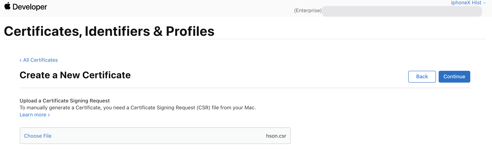

Apple Developer Enterprise Program에서 사용하는 배포용 Certification 생성하기
- Apple Developer Enterprise Program은 계정당 생성할 수 있는 배포 인증서가 2개로 제한됨 (독립된 두 개의 배포 인증서를 동시에 활성화 가능) - 인증서 3년 유효
- 첫 번째 인증서가 만료되기 전 두 번째 인증서를 생성하여 인증서를 갱신한 앱을 배포할 수 있는 유예 기간을 가짐
- 인증서 자체를 갱신하는 것은 불가하고 만료되기 직전인 인증서를 revoke 후 새로 생성하여 변경하는 방식을 사용

인증서 생성 방법은 다음과 같음
1. 개발자 인증서 생성 (.csr) - 기존 csr 파일 사용 가능
	1. 키체인 접근 > 인증서 지원 > 인증기관에서 인증서 요청...
		
	2. 원하는 이메일로 인증서 생성하기 (디스크에 저장하면 .csr 파일이 생성됨)
		
2. https://developer.apple.com/kr/ 에 접속하여 관리자 계정으로 로그인
3. Certificates, Identifiers & Profiles 클릭
4. Certificates에서 + 버튼을 클릭
	
5. Software > In-House and Ad Hoc 선택 후 Continue
	
6. 위에서 생성한(또는 기존) csr 파일 선택
	
7. 인증서 생성 완료 (로그인한 사용자 계정으로 생성됨)
	
8. 다운로드 받기 및 keyChain에 추가하기
	- 생성된 인증서를 다운로드 받은 다음 더블 클릭하면 키체인에 추가됨
9. 인증서 공유하기
	- 인증서를 생성한 키와 함께 넘기기 위해 키체인에서 해당 인증서를 선택 후 오른쪽 마우스 클릭 > 내보내기 선택
	- p12 파일로 내보내기 (암호 설정)
	- 해당 파일을 공유하고 더블 클릭으로 키체인에 등록 (암호 입력)

